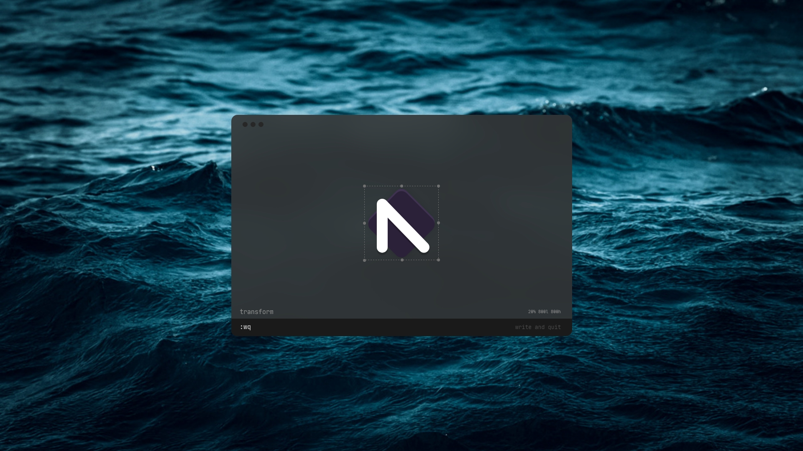

  

<h3 align="center">
minimalist vector drawing app
</h3>

<h1 align="center">
aim draw
</h1>

I'm just tired of switching from Linux to my dual-booted Windows just to use Adobe XD. GIMP and Inkscape are great projects, but his UX sucks. I just want a minimal non-distraction tool to draw simple ideas. [Left](https://github.com/hundredrabbits/Left) and vim are big inspirations for this.

## Concept

